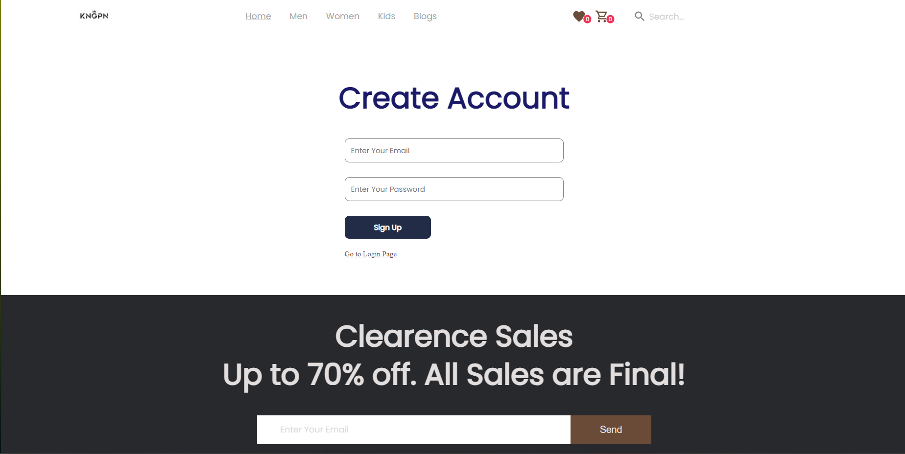

# E-commerce


This is a collaborative Final React project that we built for training, where I converted E-commerce website designs into Reactjs components using Material UI.

## Prerequisites
HTML

JSS (Javascript Styling)

Java Script/Reactjs Basics

Git & github

## Installation
1.Clone the repo

```bash
  git clone https://github.com/ahmedsaleh10/E-commerce.git
```
2.Install NPM packages
```bash
  npm install
```

## Usage/Examples
1.Start the development server


```javascript
npm start

```
2.Open your browser and go to http://localhost:3000 to see the app running.

## Features 

### Login and Sign up using firebase.





### In home page you can browse a best sales products an so on.


### You can browse a men's clothes and women's clothes in each tab.

#### As you can see you can filter summer and winter clothes.


### Product details page


### Wish list and Cart pages


## Collaborators
-Ahmad Saleh (GitHub username:ahmedsaleh10)

-Sora Abu Naser (Code Reviewer)

## Technologies Used
React

Material UI

JSS

Git

GitHub

## Acknowledgements

I would like to thank Gaza Sky Geeks for giving me the opportunity to work on this project. We would also like to thank the Material UI team for providing such a great library of components and styles that made our work easier and more efficient.

## Benefits of Collaborating on a React Project as a Team (Developer & Code Reviewer)
Working on a collaborative React project as a team can lead to increased knowledge, efficiency, communication, learning opportunities, and accountability. These benefits can help to make the project more successful and enjoyable for everyone involved.
